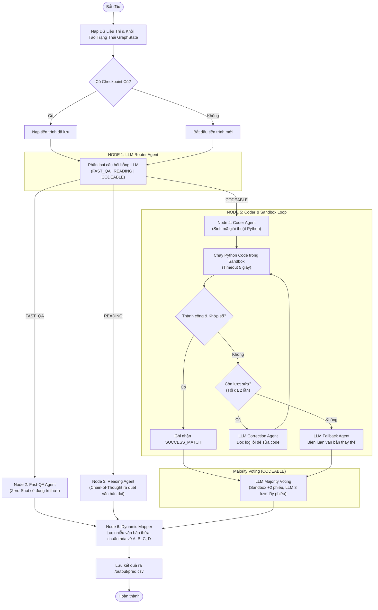

# Vietnamese Student HackAIthon 2026 - Bảng C (Innovator)

## 📌 Tổng Quan Dự Án
Đây là kho mã nguồn (Repository) của đội thi tham dự Bảng C - Cuộc thi **Vietnamese Student HackAIthon 2026**. 
Hệ thống là một **AI Agent Pipeline (Multi-Agent Graph)** xử lý đa tác vụ giải quyết bộ câu hỏi trắc nghiệm (MCQ) đa lĩnh vực. Hệ thống sử dụng mô hình **`google/gemma-4-E4B-it`** (qua Unsloth 4-bit) nhằm tối đa hóa **Accuracy** và **Inference Time**.

Đặc điểm cốt lõi của hệ thống:
- **Phân luồng thông minh (Router Agent):** Tự động nhận diện và phân phối câu hỏi về các nhánh xử lý tối ưu nhất (Kiến thức nền, Đọc hiểu, Toán học).
- **Tool-Use & Sandbox (Coder Agent):** Với các câu hỏi toán học/định lượng, LLM không tự tính toán mà đóng vai trò là một Lập trình viên sinh mã Python. Mã được chạy trong môi trường cách ly (Sandbox) với độ chính xác số học tuyệt đối.
- **Tự sửa lỗi (Self-Correction):** Nếu mã Python lỗi hoặc kết quả in ra không trùng khớp số liệu, hệ thống tự động nạp log lỗi (`stderr`/`stdout`) để sửa code.
- **Bầu chọn đa số (Majority Voting):** Hợp nhất kết quả từ Sandbox và các luồng suy luận văn bản độc lập để chọn ra đáp án đúng nhất bằng cách bỏ phiếu.
- **Cơ chế phục hồi (Checkpointing):** Liên tục sao lưu trạng thái GraphState để phòng tránh lỗi OOM hoặc mất kết nối, hệ thống sẽ tự động khôi phục và chạy tiếp thay vì bắt đầu lại từ đầu.

---

## 🏗️ Sơ Đồ Kiến Trúc Hệ Thống (Multi-Agent Pipeline)



---

## 🚀 Hướng Dẫn Triển Khai (Reproduce Kết Quả)

Theo đúng yêu cầu của Ban Tổ Chức, hệ thống đã được đóng gói hoàn chỉnh bằng Docker và sẵn sàng cho việc kiểm chứng trên môi trường của BTC.

### 1. Cấu Trúc Mount Thư Mục Bắt Buộc
- **`/data`**: Thư mục chứa dữ liệu đầu vào. Hệ thống sẽ tự động quét và nạp file `public_test.csv` hoặc `private_test.csv` có trong thư mục này.
- **`/output`**: Thư mục chứa dữ liệu đầu ra. Hệ thống sẽ ghi kết quả cuối cùng vào file `pred.csv` tại đây với định dạng 2 cột: `qid,answer`.

### 2. Các Bước Build và Chạy Bằng Docker

**Bước 1: Build Docker Image**
Từ thư mục gốc (chứa `Dockerfile`), chạy lệnh sau để build image:
```bash
docker build -t hackathon_agent:v1 .
```

**Bước 2: Chuẩn bị thư mục dữ liệu trên máy trạm**
Đảm bảo bạn có thư mục `data/` chứa file CSV đề thi và thư mục `output/` trống trên máy tính cục bộ.

**Bước 3: Chạy Docker Container**
Khởi chạy container, mount các volume tương ứng và cấp quyền cho container chạy mã (cần thiết cho Sandbox subprocess):
```bash
docker run -v $(pwd)/data:/data -v $(pwd)/output:/output hackathon_agent:v1
```

*(Lưu ý: Đối với Windows PowerShell, thay `$(pwd)` bằng `${PWD}`).*

### 3. Output Mong Đợi
Sau khi container chạy hoàn tất quá trình xử lý:
- Trong thư mục `/output`, bạn sẽ thấy file **`pred.csv`** chứa toàn bộ các cặp `qid,answer` chính xác (chỉ chứa các ký tự hoa A, B, C, D).
- Bạn cũng sẽ tìm thấy tệp `pipeline_checkpoint.json` và file `pipeline.log` để phục vụ việc kiểm tra log hệ thống (nếu có lỗi xảy ra).

---

## 📂 Cấu Trúc Mã Nguồn (Codebase Structure)

Dự án được phân rã thành các Micro-Modules đảm bảo tính bảo trì cao:
- `config/`: Cấu hình tham số hệ thống (`settings.yaml`) và logger.
- `src/core/`: Kết nối và vận hành lõi LLM (Unsloth, dọn rác VRAM).
- `src/agents/`: Chứa các node xử lý của Graph (Router, Fast-QA, Reading, Coder).
- `src/tools/`: Môi trường giả lập (Sandbox) cho Python subprocess.
- `src/pipeline/`: I/O dữ liệu, Checkpointing, Dynamic Mapper và Majority Voting.
- `src/main.py`: Entry-point kết nối luồng đi của hệ thống.

---
**Chúng tôi xin chân thành cảm ơn Ban Tổ Chức đã mang đến một sân chơi bổ ích!**
