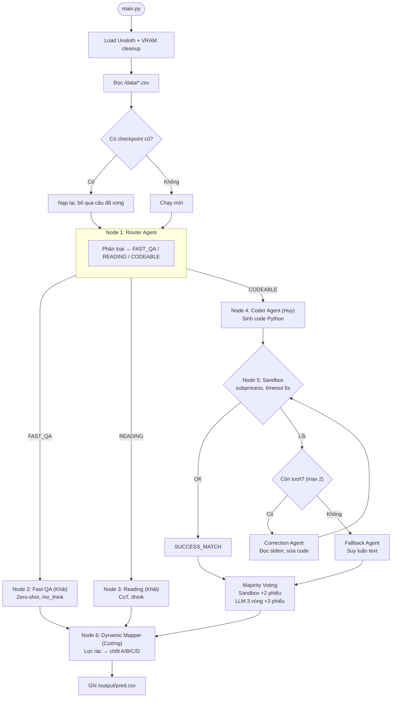

# Plan — Khang (Nhóm Trưởng)

Không code. Giám sát, review, test, nộp bài.

---

## 1. Việc cần làm

### 1.1. Setup repo GitHub
- Tạo repo, mời Khải, Huy, Cường.
- Tạo nhánh `dev-khai`, `dev-huy`, `dev-cuong`. Merge vào `main` chỉ khi review xong.

### 1.2. Review Code (PR)
Khi review PR, kiểm tra đúng các điều kiện sau:
- **PR của Khải:** Có gọi `cleanup_vram()` sau mỗi batch không? Nếu không sẽ tràn RAM khi chạy 2000 câu. *(Xem mục 4.3, [report_pipeline.md dòng 272](file:///d:/Competition/Hackathon/report/report_pipeline.md#L272))*
- **PR của Huy:** Sandbox có đặt `timeout=5` không? Không có timeout thì vòng lặp vô hạn sẽ treo container. *(Xem mục 3.5, [report_pipeline.md dòng 227](file:///d:/Competition/Hackathon/report/report_pipeline.md#L227))*
- **PR của Cường:** Dynamic Mapper có kiểm tra `max_allowed_index` không? Nếu đề có 4 đáp án mà trả về E thì mất điểm. *(Xem mục 4.2, [report_pipeline.md dòng 265](file:///d:/Competition/Hackathon/report/report_pipeline.md#L265))*

### 1.3. Chạy test End-to-End
- Lấy 100 câu hỏi đa dạng (toán, lý, hóa, văn, sử, địa, luật).
- Chạy `python src/main.py`, đo:
  - **Accuracy:** Bao nhiêu câu đúng / tổng. Mục tiêu > 70%.
  - **Thời gian:** Bao lâu cho 100 câu. Quy ra 2000 câu xem có vượt quota không.
- Nếu Accuracy thấp → báo Khải điều chỉnh prompt hoặc Huy xem lại Sandbox.
- Nếu chậm → báo Khải giảm `max_new_tokens` ở luồng Fast-QA.

### 1.4. Viết README.md + Nộp bài
- Copy sơ đồ Mermaid bên dưới vào README.md.
- Mô tả ngắn gọn kiến trúc Multi-Agent.
- Push Docker Image lên Docker Hub.
- Nộp link GitHub + Docker Hub cho BTC.

---

## 2. Tiêu chí chấm điểm (ghi nhớ khi review)

| Tiêu chí | Điểm | Ảnh hưởng đến ai |
|---|---|---|
| Accuracy (độ chính xác) | 80 | Khải (prompt), Huy (sandbox + voting) |
| Inference Time (tốc độ) | 10 | Khải (Fast-QA zero-shot, giảm token) |
| Ý tưởng sáng tạo | 10 | Cả team (kiến trúc Multi-Agent) |

*(Nguồn: [bao_cao_chi_tiet_bang_C.md dòng 12-15](file:///d:/Competition/Hackathon/bao_cao_chi_tiet_bang_C.md#L12))*

---

## 3. Yêu cầu đầu ra từ BTC

- Docker Container nộp qua Docker Hub.
- Entry-point: Đọc `public_test.csv` hoặc `private_test.csv` tại `/data`.
- Ghi `pred.csv` vào `/output` với 2 cột: `qid,answer` (A/B/C/D).
- Kèm GitHub chứa code và tài liệu thuyết minh.

*(Nguồn: [rule.txt](file:///d:/Competition/Hackathon/rule.txt))*

---

## 4. Sơ đồ kiến trúc (Copy vào README.md)

*(Nguồn: [report_pipeline.md dòng 9-67](file:///d:/Competition/Hackathon/report/report_pipeline.md#L9) và [current_pipeline_architecture.md dòng 42-93](file:///d:/Competition/Hackathon/report/current_pipeline_architecture.md#L42))*



---

## 5. Luồng Data Flow (để theo dõi tiến độ team)

```
Cường: main.py → load data → load checkpoint
  → Khải: router.py → phân loại batch
    → Khải: fast_qa.py / reading.py (câu text)
    → Huy: coder.py → python_sandbox.py → majority_voting.py (câu toán)
  → Cường: dynamic_mapper.py → chốt A/B/C/D
  → Cường: checkpointing.py → lưu state
  → Cường: ghi pred.csv
```
