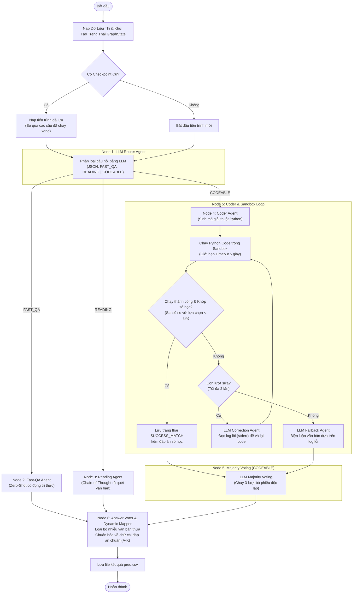

# Báo Cáo Kiến Trúc & Tư Duy Thiết Kế Hệ Thống Multi-Agent MCQ Pipeline

Tài liệu này trình bày về tư duy thiết kế, kiến trúc đồ thị đa tác tử (Multi-Agent Graph), và quy trình vận hành cốt lõi của hệ thống giải bài thi trắc nghiệm tự động đa lĩnh vực.

---

## 1. Triết Lý Thiết Kế & Hướng Tư Duy Cốt Lõi

Khi giải quyết các đề thi trắc nghiệm tổng hợp (khoa học tự nhiên, khoa học xã hội, văn học, luật, toán), một mô hình LLM đơn lẻ thường gặp phải các giới hạn về ảo giác số học và quá tải ngữ cảnh. Hệ thống này được xây dựng dựa trên 5 tư duy thiết kế cốt lõi:

### 1.1. Tư duy "Chia để trị" (Divide and Conquer)
Không có một cấu trúc prompt nào tối ưu được cho mọi loại câu hỏi.
*   **FAST_QA:** Cần câu trả lời nhanh, cô đọng bằng tri thức nền của mô hình mà không cần tốn chi phí suy luận Chain-of-Thought (CoT) dài dòng.
*   **READING:** Đòi hỏi khả năng rà quét thông tin chi tiết, đối chiếu văn bản diện rộng và phân tích bẫy chữ (như từ phủ định "không", "ngoại trừ").
*   **CODEABLE:** Đòi hỏi sự chính xác tuyệt đối về mặt số học và logic công thức.

Do đó, **LLM Router Agent** đóng vai trò như một bộ phân loại đầu vào để định hướng câu hỏi về đúng nhánh xử lý chuyên biệt, tối ưu hóa cả độ chính xác lẫn tài nguyên token.

### 1.2. Tư duy "Sử dụng công cụ thay vì tự tính toán" (Tool-Use over Arithmetic)
LLM là mô hình xác suất từ ngữ, không phải máy tính số học. Khi gặp các câu hỏi toán lý hóa, LLM rất dễ tính toán sai số hoặc đưa ra kết quả ngẫu nhiên (ảo giác số học).
*   **Giải pháp:** Thay vì bắt LLM tự tính nhẩm, hệ thống bắt LLM đóng vai trò là một **Lập trình viên (Coder Agent)** sinh mã Python để giải quyết bài toán.
*   **Sandbox:** Chạy đoạn mã đó trong môi trường độc lập (Sandbox) để lấy kết quả số học thô chính xác từ trình thông dịch Python.

### 1.3. Tư duy "Tự sửa sai bằng vòng phản hồi" (Self-Correction & Feedback Loop)
Mã Python do LLM sinh ra lần đầu có thể gặp lỗi cú pháp (Syntax Error) hoặc lỗi logic.
*   Hệ thống thiết lập một quy trình kiểm tra tự động: chạy code thử, kiểm tra thông báo lỗi (`stderr`) và đối chiếu kết quả đầu ra với các con số trong phương án trắc nghiệm.
*   Nếu có lỗi, thông tin lỗi sẽ được gửi ngược lại cho **LLM Correction Agent** để nó tự vá và tối ưu lại code. Điều này mô phỏng chính xác quy trình làm việc của một kỹ sư lập trình: viết code -> chạy thử -> sửa lỗi dựa trên log.

### 1.4. Tư duy "Đồng thuận tập thể" (Majority Voting)
Đối với luồng toán học phức tạp, kết quả chạy code Python đôi khi không khớp hoàn toàn với định dạng đáp án trắc nghiệm, hoặc code bị lỗi runtime.
*   Hệ thống sử dụng cơ chế **LLM Majority Voting** chạy song song 3 lượt lấy phiếu độc lập.
*   Kết quả định lượng từ Python Sandbox (nếu chạy thành công) sẽ được đưa vào làm dữ liệu gợi ý (Hint) cho LLM và được cộng **ưu tiên 2 phiếu**.
*   LLM sẽ kết hợp lập luận logic văn bản của mình với kết quả gợi ý của Python để bỏ phiếu cho phương án đúng nhất. Sự kết hợp này mang lại sự cân bằng giữa tính toán định lượng chính xác (Python) và suy luận định tính tốt (LLM).

### 1.5. Tư duy "Lọc nhiễu định dạng" (Rule-based Post-Processing)
LLM thường có xu hướng viết thêm các câu dẫn giải thích dông dài hoặc trả về định dạng sai (ví dụ: trả về `Đáp án là A` hoặc `Phương án đúng: B`).
*   Hệ thống cô lập hoàn toàn khâu suy luận của LLM ra khỏi khâu định dạng đáp án.
*   Ở Node cuối cùng (**Dynamic Mapper**), một bộ lọc dựa trên quy tắc (Rule-based) và thuật toán so khớp ký tự (Intersection matching) sẽ rà quét chuỗi đầu ra của LLM, loại bỏ nhiễu chữ và ánh xạ chính xác về một chữ cái đáp án duy nhất hợp lệ (A, B, C, D...).

---

## 2. Sơ Đồ Quy Trình Hoạt Động (Mermaid Diagram)

Quy trình xử lý dữ liệu đi qua các Agent Node trong đồ thị được biểu diễn như sau:



---

## 3. Chi Tiết Kiến Trúc Các Tác Tử (Agent Nodes)

### 3.1. Node 1: LLM Router Agent (Tác tử Định Tuyến)
*   **Mục tiêu:** Định hướng chính xác luồng xử lý của câu hỏi.
*   **Dữ liệu vào:** Câu hỏi (`question`) và các phương án lựa chọn (`choices`).
*   **Đầu ra:** Chuỗi JSON thô chứa nhãn phân luồng duy nhất: `{"route": "FAST_QA" | "READING" | "CODEABLE"}`.

### 3.2. Node 2: Fast-QA Agent (Tác tử Trí Thức Nền)
*   **Mục tiêu:** Giải quyết các câu hỏi dạng ghi nhớ, định nghĩa, lịch sử/địa lý ngắn.
*   **Tư duy:** Yêu cầu mô hình truy xuất bộ nhớ tham số một cách trực tiếp (Zero-Shot). Prompt được thiết kế tối giản phần giải thích để tránh sinh token rác và giảm thời gian phản hồi.

### 3.3. Node 3: Reading Comprehension Agent (Tác tử Đọc Hiểu)
*   **Mục tiêu:** Xử lý các câu hỏi ngữ cảnh dài đòi hỏi đối chiếu dữ kiện chặt chẽ.
*   **Tư duy:** Sử dụng cờ hiệu sinh lập luận Chain-of-Thought (`/think`) để mô hình tự phân tích, đối chiếu từng câu/đoạn trong văn bản trước khi đưa ra đáp án. Tập trung cao độ vào việc phát hiện bẫy phủ định và bẫy dữ kiện bị thiếu.

### 3.4. Node 4 & 5: Coder & Sandbox Loop Agent (Tác tử Tính Toán Toán Học)
Đây là module cốt lõi giải quyết bài toán định lượng thông qua sự kết hợp giữa LLM và Môi trường thực thi code (Python Sandbox).

```
[Câu hỏi Toán] ──> [Coder Agent] ──> [Mã Python] ──> [Chạy Sandbox]
                                                           │
        ┌────────────────── Khởi chạy lại ─────────────────┤
        ▼                                                  ▼
[LLM Correction] <── [Lỗi/Lệch Số] ── [Kiểm Tra Kết Quả] ──> [Thành công] ──> [Majority Voting]
```

1.  **Giai đoạn viết mã:** **Coder Agent** chuyển đổi đề bài toán/lý/hóa thành các bước gán biến, tính toán và giải hệ phương trình bằng các thư viện Python như `sympy`, `math`.
2.  **Giai đoạn thực thi:** Code được ghi ra file tạm và thực thi thông qua một tiến trình con (`subprocess`). Thời gian chạy tối đa là 5 giây để ngăn các lỗi lặp vô hạn (Infinite Loop).
3.  **Giai đoạn vá lỗi (Correction):** Nếu code lỗi (Runtime Error) hoặc kết quả in ra không trùng khớp số học với phương án lựa chọn nào, hệ thống gửi code cũ cùng toàn bộ `stderr`/`stdout` cho **Correction Agent** sửa lại. Tối đa 2 chu kỳ sửa đổi.
4.  **Giai đoạn cứu hộ (Fallback):** Nếu sau 2 lượt sửa vẫn lỗi, hệ thống kích hoạt **Fallback Agent** để giải quyết bằng suy luận văn bản thông thường, sử dụng thông tin lỗi từ sandbox làm tài liệu tham khảo để suy luận loại trừ.

### 3.5. Node 5: Majority Voting (Bầu Chọn Đa Số)
*   **Mục tiêu:** Hợp nhất kết quả từ Sandbox và suy luận logic để tìm ra phương án tối ưu nhất cho các câu hỏi toán học.
*   **Cơ chế:**
    *   Hệ thống chạy 3 lượt truy vấn song song đến LLM với nhiệt độ (`temperature = 0.3`) nhằm tạo ra các góc nhìn suy luận hơi khác biệt.
    *   **Gợi ý số học (Hint):** Đưa kết quả từ Python Sandbox (nếu thành công) vào prompt để định hướng cho LLM. Nếu đáp án từ Sandbox khớp với một phương án trắc nghiệm cụ thể, phương án đó sẽ được cộng **2 phiếu ưu tiên**.
    *   Hệ thống gom tất cả các phiếu bầu từ Sandbox và 3 lượt chạy LLM để chọn ra phương án nhận được nhiều phiếu nhất làm đáp án cuối cùng.

### 3.6. Node 6: Answer Voter & Dynamic Mapper (Tác tử Chuẩn Hóa)
*   **Mục tiêu:** Đảm bảo kết quả đầu ra luôn sạch sẽ và tương thích 100% với định dạng yêu cầu của đề thi (ký tự hoa A, B, C, D...).
*   **Tư duy:** 
    *   Sử dụng giải thuật **Set Intersection Similarity** để tính toán sự giao thoa ký tự giữa câu trả lời thô của LLM và nội dung các phương án trắc nghiệm. Phương án nào có số lượng ký tự trùng khớp nhiều nhất sẽ được chọn.
    *   Kiểm tra tính hợp lệ về mặt kỹ thuật: Đảm bảo chỉ số đáp án ánh xạ không vượt quá số lượng phương án thực tế của câu hỏi đó (ví dụ: câu hỏi chỉ có 4 lựa chọn A-D thì không được phép trả về E hoặc F).

---

## 4. Quản Lý Tiến Trình Tự Phục Hồi (Checkpointing)
Kiến trúc đồ thị đa tác tử yêu cầu một cơ chế duy trì trạng thái bền vững. Hệ thống lưu trữ trạng thái định kỳ thông qua tệp tin JSON tĩnh.
*   Mỗi khi xử lý xong một lô câu hỏi tại một Node bất kỳ, trạng thái `GraphState` hiện tại sẽ được đồng bộ ngay xuống ổ đĩa cứng.
*   Nếu xảy ra sự cố đột ngột (mất kết nối máy chủ, tràn bộ nhớ hệ thống), trong lần khởi chạy tiếp theo, hệ thống sẽ tự động phát hiện file checkpoint này, nạp lại trạng thái đã lưu, và tiếp tục xử lý các câu hỏi chưa hoàn thành. Điều này đảm bảo tính bền bỉ và tiết kiệm tối đa thời gian thực thi của cả hệ thống.
