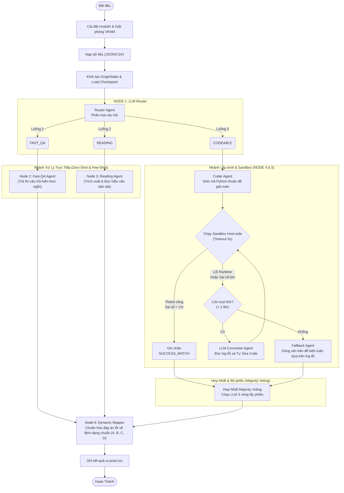

# Báo Cáo Kỹ Thuật Chuyên Sâu: Kiến Trúc Multi-Agent Pipeline Giải Trắc Nghiệm

Báo cáo này phân tích chi tiết toàn bộ mã nguồn của hệ thống tự động giải trắc nghiệm (Multiple-choice QA) đa lĩnh vực. Hệ thống sử dụng mô hình **`google/gemma-4-E4B-it`** (với Unsloth 4-bit), vận hành theo cấu trúc **Đồ thị Đa tác tử (Multi-Agent Graph)**. 

Báo cáo được thiết kế để người đọc có thể hiểu được 100% hướng tiếp cận, luồng dữ liệu, thuật toán xử lý và hệ thống prompt mà không cần phải tra cứu lại mã nguồn Python.

---

## 1. Sơ Đồ Pipeline Hệ Thống (Mermaid Diagram)

Dưới đây là sơ đồ luồng dữ liệu đi qua các Node (Agent) của hệ thống. 



---

## 2. Quản Lý Trạng Thái (GraphState) & Checkpointing

Để quản lý luồng dữ liệu như một đồ thị, hệ thống dùng một từ điển trạng thái toàn cục `GraphState` (kế thừa tư tưởng LangGraph) bao gồm:
- `questions`: Chứa nguyên bản các câu hỏi và các lựa chọn (choices).
- `choice_counts`: Số lượng phương án của từng câu (để phục vụ việc chuẩn hóa đáp án cuối).
- `routes`: Phân luồng của từng câu (FAST_QA, READING, CODEABLE).
- `execution_codes`: Lưu mã Python được sinh ra (dành cho luồng CODEABLE).
- `sandbox_results`: Lưu kết quả chạy code (stdout, stderr, success flag).
- `final_answers`: Đáp án cuối cùng chốt lại cho từng câu.

**Cơ chế Checkpoint (Tự phục hồi):**
Cứ sau khi xử lý xong một lô (batch size = 8 đến 10), hệ thống sẽ ghi đè toàn bộ `GraphState` vào file `output/pipeline_checkpoint.json`. Nhờ vậy, nếu Google Colab ngắt kết nối, cạn RAM, hoặc bị Timeout `KeyboardInterrupt`, lần chạy tiếp theo hệ thống sẽ nạp lại file JSON này và tiếp tục chạy từ vị trí bị ngắt mà không làm lại từ đầu.

---

## 3. Phân Tích Hệ Thống Prompt Của Từng Node

Mỗi Node được thiết kế như một chuyên gia riêng biệt. Để cấm LLM nói nhảm (yapping) và bắt buộc trả về định dạng chuẩn, các kỹ thuật như JSON Format Enforcing, Few-shot Prompting, và Cờ điều khiển (`/think`, `/no_think`) được áp dụng triệt để.

### 3.1. Node 1: Router Agent (Bộ Định Tuyến)
**Mục tiêu:** Chia để trị. Không dùng chung 1 prompt để giải mọi bài toán. Định tuyến câu hỏi về đúng Node.
*   **System Prompt:**
    ```text
    Bạn là bộ định tuyến dữ liệu siêu tốc của hệ thống LangGraph. Nhiệm vụ của bạn là phân loại câu hỏi đầu vào vào một nhóm duy nhất.
    Bắt buộc phải trả về dữ liệu cấu trúc dưới dạng JSON khớp với schema sau:
    {"route": "FAST_QA" | "READING" | "CODEABLE"}

    Quy tắc phân loại:
    1. 'READING': Nếu câu hỏi là đọc hiểu văn bản dài, có các đoạn thông tin hoặc đoạn trích lịch sử/pháp luật dài phức tạp.
    2. 'CODEABLE': Nếu câu hỏi yêu cầu giải toán, tính công thức tài chính/kinh tế, tính số liệu lý/hóa cụ thể.
    3. 'FAST_QA': Định nghĩa ngắn, tri thức nền hoặc kiểm tra sự thật đơn giản dưới 2000 ký tự.
    Chỉ trả ra chuỗi JSON sạch. Tuyệt đối không viết thêm lời dẫn.
    ```
*   **Cấu hình sinh:** `temperature=0.0` (đảm bảo tính nhất quán tuyệt đối), `max_new_tokens=32`.

### 3.2. Node 2: Fast-QA Agent
**Mục tiêu:** Giải quyết các câu hỏi kiến thức phổ thông bằng cách truy xuất bộ nhớ nội tại của LLM một cách nhanh chóng.
*   **System Prompt:**
    ```text
    Bạn là chuyên gia trắc nghiệm tri thức. Hãy phân tích và chọn đáp án đúng duy nhất.
    Bắt buộc phải trả về định dạng cấu trúc JSON sạch khớp chính xác với mẫu sau:
    {"reasoning": "Suy luận ngắn gọn (độ dài tối đa 1 câu)", "answer": "Chữ cái viết hoa duy nhất (Ví dụ: A hoặc B hoặc C...)"}

    QUY TẮC PHÒNG THỦ TRÀN TOKEN:
    Phần 'reasoning' chỉ được viết đúng 1 câu duy nhất, đi thẳng vào bản chất tri thức nền. Tuyệt đối không giải thích dông dài, không viết ngoài khối JSON.
    ```
*   **User Prompt (có `/no_think`):**
    ```text
    /no_think
    Ví dụ mẫu:
    Câu hỏi: Thủ đô của Việt Nam là gì?
    Lựa chọn:
    A. TP. Hồ Chí Minh
    B. Hà Nội
    Đầu ra mẫu:
    ```json
    {
      "reasoning": "Hà Nội là thủ đô hành chính chính thức của Việt Nam.",
      "answer": "B"
    }
    ```

    BÂY GIỜ HÃY GIẢI CÂU HỎI SAU VÀ TUÂN THỦ JSON THUẬN CÔ ĐỌNG:
    Câu hỏi: {question}
    Lựa chọn: {choices}
    ```

### 3.3. Node 3: Reading Comprehension Agent (Đọc hiểu)
**Mục tiêu:** Rà soát và tìm kiếm thông tin trong văn bản dài. Đề phòng các câu hỏi có bẫy phủ định ("không phải", "ngoại trừ").
*   **System Prompt:**
    ```text
    Bạn là chuyên gia rà soát bẫy văn bản dài. Hãy đối chiếu chi tiết các tình huống, rà soát kỹ các từ phủ định (không phải, ngoại trừ, sai) để trích xuất thông tin.
    Bắt buộc phải trả về định dạng cấu trúc JSON sạch khớp chính xác với mẫu sau:
    {"reasoning": "Đối chiếu bối cảnh tài liệu (tối đa 1 đến 2 câu ngắn)", "answer": "Chữ cái đáp án viết hoa đúng nhất"}

    QUY TẮC CHỐNG CẮT CỤT CHUỖI DO HẾT TOKEN:
    Phần 'reasoning' phải viết cực kỳ cô đọng, đi thẳng vào việc chỉ rõ Đoạn/Tài liệu nào chứa từ khóa để chốt đáp án. Tuyệt đối không chép lại cả đoạn văn bản dài vào JSON.
    ```
*   **User Prompt (có `/think`):** Kích hoạt tư duy Chain-of-Thought nội tại của mô hình giúp nâng cao độ chính xác khi đối chiếu văn bản.
    ```text
    /think
    Ví dụ mẫu:
    Câu hỏi: Giai đoạn Mạt Pháp bắt đầu khi nào theo tài liệu?
    Lựa chọn:
    A. 1000 năm
    B. 1500 năm
    Đầu ra mẫu:
    ```json
    {
      "reasoning": "Tài liệu tại Đoạn 1 ghi nhận thời điểm Mạt Pháp bắt đầu là 1500 năm sau khi Thích Ca nhập niết bàn, khớp với phương án B.",
      "answer": "B"
    }
    ```

    BÂY GIỜ HÃY ĐỐI CHIẾU VĂN BẢN VÀ GIẢI CÂU HỎI SAU:
    Câu hỏi: {question}
    Lựa chọn: {choices}
    ```

### 3.4. Node 4: Coder Agent (Mã hóa tính toán)
**Mục tiêu:** LLM thường tính toán sai (ảo giác số học). Vì vậy, Agent này không được phép đưa ra đáp án, mà chỉ được viết mã Python để giải bài.
*   **System Prompt:**
    ```text
    Bạn là một chuyên gia lập trình Python tối giản, phụ trách xử lý các bài toán định lượng và logic đa ngành.
    Nhiệm vụ: Hãy viết mã nguồn Python hoàn chỉnh để giải bài toán. Bạn được cung cấp danh sách phương án trắc nghiệm thực tế CHỈ ĐỂ tham khảo dạng kết quả số học hoặc kí tự đại số.

    QUY TẮC ÉP KHUÔN ĐỊNH DẠNG TUYỆT ĐỐI KHÔNG GÂY LỖI CÚ PHÁP:
    1. CẤM TUYỆT ĐỐI SỬ DỤNG KÝ TỰ DẤU THĂNG (#). Không viết comment, không tạo chuỗi hậu tố lặp lại dông dài.
    2. CẤM TUYỆT ĐỐI IN RA CÁC KÝ TỰ NHÃN ĐÁP ÁN NHƯ 'A', 'B', 'C', 'D'...
    3. QUY TẮC LỆNH PRINT() CUỐI CÙNG:
       - Nếu các phương án lựa chọn chứa số (kể cả số có kèm đơn vị như %, g, kJ/mol, đô la), lệnh print BẮT BUỘC chỉ được in ra duy nhất GIÁ TRỊ SỐ NGUYÊN HOẶC SỐ THỰC THUẦN TUÝ (Ví dụ: print(float(gia_tri))). Tuyệt đối không thêm chuỗi đơn vị vào lệnh print.
       - Nếu các phương án lựa chọn là biểu thức kí tự hoặc phương trình đại số (có chứa mã LaTeX $), lệnh print BẮT BUỘC phải in ra chuỗi biểu thức sạch sau khi gọi str(ket_qua) từ SymPy. Tuyệt đối không bọc kí tự $ vào lệnh print.
    4. Toàn bộ mã nguồn phải bọc gọn trong cấu trúc phòng thủ try-except toàn cục. Nhánh except chỉ viết duy nhất: print('ERROR').
    5. Chỉ xuất duy nhất khối mã nằm trong thẻ ```python và ```. Không viết lời dẫn.
    ```
*   **User Prompt (Chứa các Few-shots siêu việt về ép code):**
    ```text
    /no_think
    Ví dụ 1 (Đề bài chứa số hoặc đơn vị kèm theo như %, g, kJ/mol, đô la):
    Câu hỏi: Tính khối lượng NaOH cần dùng để trung hòa 200ml dung dịch HCl 1M.
    Lựa chọn đáp án:
    A. 40g.
    B. 80g.
    C. 160g.
    Mã nguồn mẫu:
    ```python
    try:
        n_hcl = 0.2 * 1.0
        m_naoh = n_hcl * 40.0
        print(float(m_naoh))
    except:
        print('ERROR')
    ```

    Ví dụ 2 (Đề bài chứa công thức kí tự, phương trình đại số):
    Câu hỏi: Tìm nghiệm của phương trình vi phân đạo hàm bậc nhất B'(t) = -k*B(t) với điều kiện biên B(0)=B0.
    Lựa chọn đáp án:
    A. B0 * exp(-k * t)
    B. B0 / (1 + k * t)
    Mã nguồn mẫu:
    ```python
    try:
        import sympy
        t, B0, k = sympy.symbols('t B0 k')
        ket_qua = B0 * sympy.exp(-k * t)
        print(str(ket_qua))
    except:
        print('ERROR')
    ```

    BÂY GIỜ HÃY GIẢI CÂU HỎI SAU, CHÚ Ý PRINT KẾT QUẢ SỐ THUẦN TUÝ HOẶC CHUỖI BIỂU THỨC SẠCH KHÔNG CHỨA LỖI BIẾN SỐ:
    Câu hỏi: {question}
    Lựa chọn đáp án thực tế:
    {choices}
    ```

### 3.5. Node 5: Self-Correction & Fallback (Tự Sửa Lỗi)
Mã Python sau khi sinh sẽ được hệ thống chạy bằng `subprocess.run()`. Nếu mã bị lỗi `SyntaxError`, `ValueError`, hoặc in ra số lệch quá 1% so với các phương án trắc nghiệm, hệ thống sẽ kích hoạt **Correction Agent**.

*   **Correction System Prompt:**
    ```text
    Bạn là một chuyên gia sửa lỗi và tối ưu hóa mã nguồn Python đa ngành.
    Nhiệm vụ: Viết lại một script Python hoàn chỉnh mới, sửa đổi logic tính toán hoặc sửa triệt để lỗi gọi tên biến/cú pháp trong hàm print để xuất ra kết quả thô chính xác.
    ... [Các quy tắc cấm in chữ cái A,B,C và kiểm tra kĩ biến] ...
    ```
*   **Correction User Prompt:** Cung cấp nguyên bản câu hỏi, đáp án, mã lỗi và đặc biệt là **thông báo lỗi (stderr/stdout)** thu được từ hệ thống để LLM biết đường sửa.

*   **Fallback Agent (Sau 2 lần thử code thất bại):**
    ```text
    Bạn là chuyên gia giải đề trắc nghiệm có tư duy phản biện cao.
    Thuật toán viết mã giải toán trước đó của hệ thống đã bị tính toán lệch số hoặc lỗi runtime sau nhiều lần thử.
    Nhiệm vụ: Dựa vào câu hỏi, các phương án lựa chọn và chi tiết log lỗi của chương trình, hãy phân tích lập luận văn bản để tìm ra đáp án đúng cuối cùng.
    ```

### 3.6. Node Hợp Nhất: Majority Voting
Sau khi có kết quả từ Sandbox (số thuần túy), nó vẫn chưa phải là đáp án chốt. Hệ thống sử dụng Voting Agent để xem xét lại logic.
*   **Voting System Prompt:**
    ```text
    Bạn là chuyên gia toán học xuất sắc. Dựa trên câu hỏi, phương án trắc nghiệm và kết quả gợi ý định lượng được cung cấp, hãy chọn đáp án đúng nhất.
    Bắt buộc phải trả về định dạng cấu trúc JSON sạch...
    ```
*   **User Prompt (Chứa Hint):** `\n[Kết quả chạy chương trình Python gợi ý]: {stdout_val}\n[Khớp phương án số học tương ứng]: {closest_letter}`
*   **Cơ chế bầu:** Phương án được Python tính ra thành công (Sai số < 1%) auto được cộng **2 phiếu**. LLM được chạy 3 lần độc lập (Temperature 0.3) sinh ra thêm **3 phiếu**. Phương án nào nhiều phiếu nhất sẽ thắng.

---

## 4. Các Thuật Toán Và Kỹ Thuật Tối Ưu Nổi Bật 

### 4.1. Bóc Tách Số Liệu Tinh Vi (Regex)
Các phương án trắc nghiệm thường chứa chữ (vd: `$45.2kg` hoặc `-1/2`). Hệ thống sử dụng hàm `extract_numbers_from_text` với Biểu thức chính quy (Regex) để hút đúng giá trị số (float):
- Bắt phân số: `r'(-?\b\d+)/(\d+\b)'`
- Bắt số thập phân: `r'-?\b\d+\.?\d*'`
Từ đó dễ dàng so sánh với kết quả in ra của file Python bằng phép tính sai số tương đối: `abs(target_val - val) / max(abs(val), 1.0)`. Nếu `<= 0.01` (1%) thì tính là khớp chuẩn.

### 4.2. Khắc Phục Lỗi "Ảo Giác Ký Tự" (Dynamic Mapper)
Đôi khi, thay vì trả về ký tự `A`, LLM lại trả về `Đ` hoặc nguyên chuỗi `Đáp án là A`.
Hàm `answer_voter_and_mapper_node` giải quyết triệt để việc này:
- Xóa toàn bộ ký tự đặc biệt bằng `clean_text_for_match`.
- Dùng độ đo `Intersection` (phép giao) của tập hợp các ký tự `len(set(clean_target) & set(clean_comp))` để tìm xem chuỗi của LLM giống với phương án `A, B, C, D` nào nhất.
- Kiểm tra tính an toàn (`max_allowed_index`): Đảm bảo chữ cái trả về không vượt quá số lượng đáp án thực tế của câu hỏi.

### 4.3. Quản Trị VRAM GPU Tối Đa
- Vô hiệu hóa tính năng gradient (`torch.no_grad()`).
- Chia batch cực nhỏ (`node_batch_size = 8 đến 10`) trong khi gọi hàm sinh text `model.generate()`.
- Xóa rác biến thủ công: `del inputs, del outputs, torch.cuda.empty_cache()` sau mỗi batch.
- Áp dụng Unsloth (`load_in_4bit=True`). 

## Tổng Kết
Toàn bộ mã nguồn là một thiết kế chuẩn mực của kỹ thuật LLMOps hiện đại: Thay vì chỉ biết "hỏi-đáp" đơn thuần, tác giả đã trang bị cho LLM **tay chân** (Sandbox), **trí nhớ** (Checkpoint), **kỷ luật** (JSON Pydantic, Rule-based Mapper) và **chiến lược sửa sai** (Self-Correction/Fallback).
